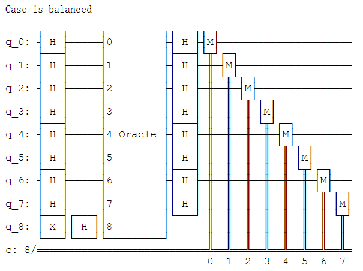
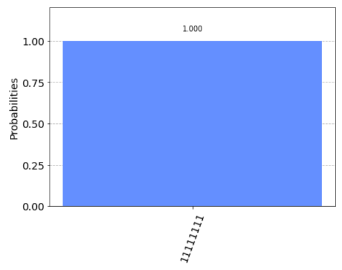
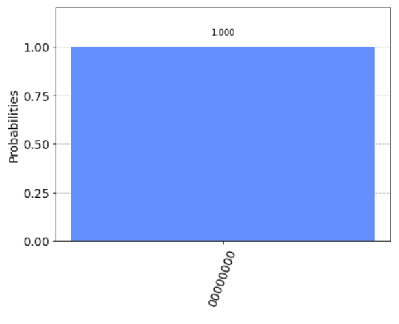

# FullAdder
## Instances
---
- ### 0 + 0 + 0(CIN) = 0(COUT) 0

---
- ### 1 + 0 + 0(CIN) = 0(COUT) 1

---
- ### 1 + 0 + 1(CIN) = 1(COUT) 0

---
- ### 1 + 1 + 1(CIN) = 1(COUT) 1

---
# DJProblem
- ### Circuit

## Instances
---
- ### balanced

---
- ### constant

